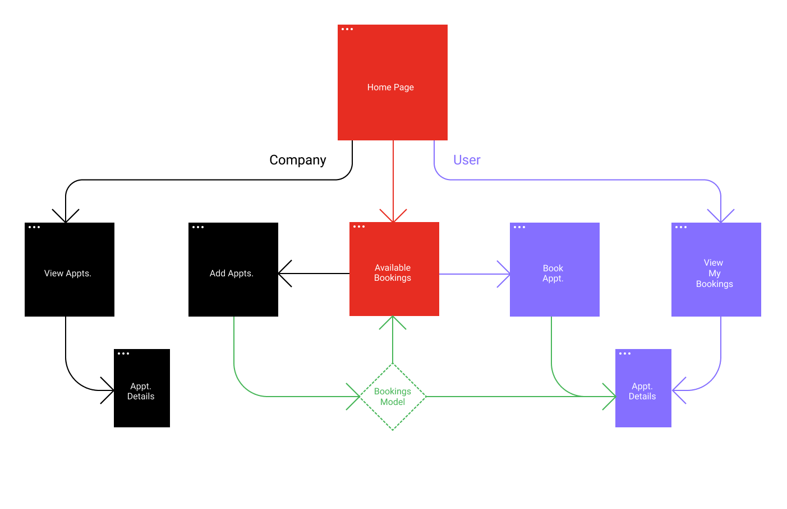
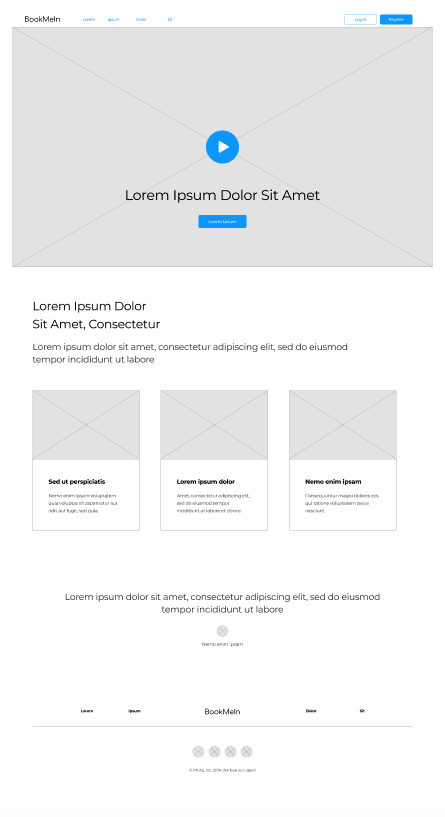
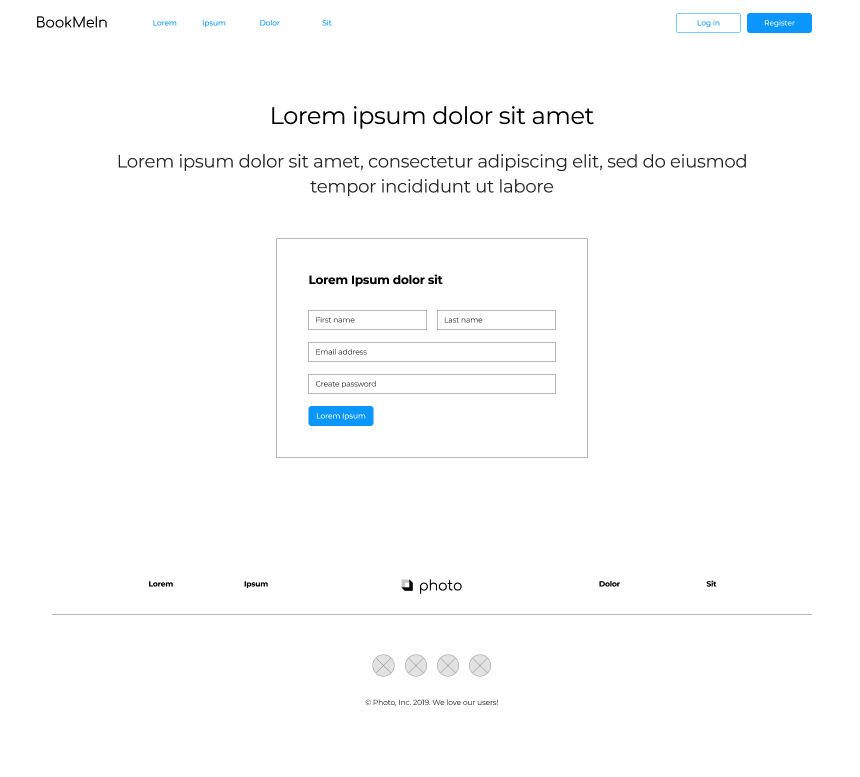
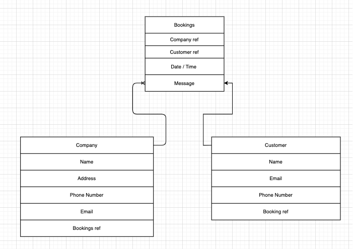

# Project 1
### Gabriel &amp; Binay

## MVP Pitch
Project 1 is an online booking software that allows users to book appointments with this company. The company can add their availble times and users can book a slot. 

## User Stories
* Company provides a service.
* Company is available for appointments.
* Company is able to create time slots for the week.
* Company is able to edit the time slots.
* Company is able to delete time slots.
* Company is able to see their appointments.
* User is able to see available time slots.
* User fills in their name, email, phone, and selects time slot.
* Time slots are displayed in a dropdown.
* User is able to book a time slot.
* User cannot cancel their appointment.
* User is able to see their bookings.

## Milestones

* Saturday - User MVC
* Sunday - Company MVC
* Monday - Booking MVC / Relationships
* Tuesday - Relationships / Front End
* Wednesday - Front End / MVP
* Thursday - Debugging / Stretch Goals
* Friday - Wrap Up / Present

## Wire frames

## ERD

##  Stretch Goals

* Login page for users.
* Add calendar to select bookings.
* User can cancel booking and time slot will be available again.
* User Reviews.
